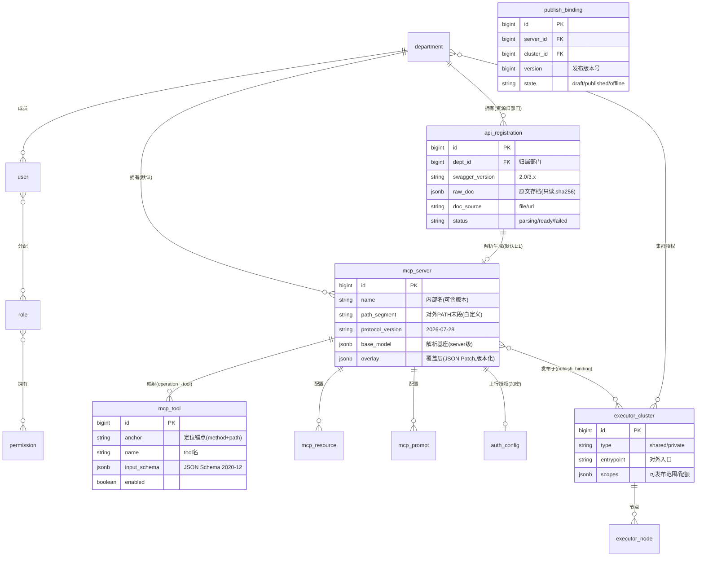
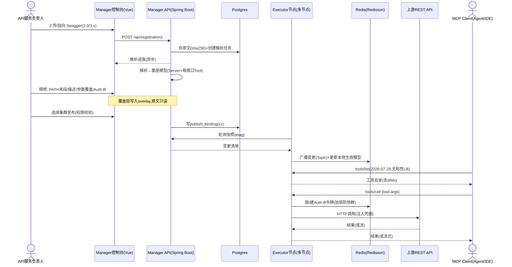
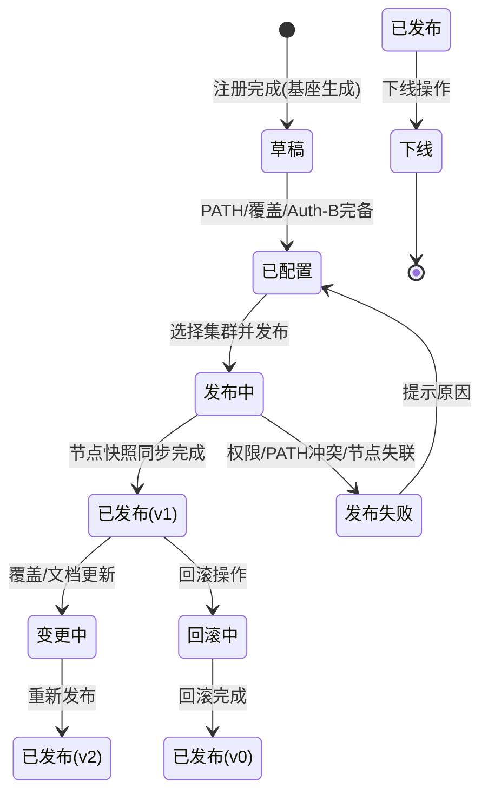

# MCP 桥接平台（工作代号：MCP Bridge）产品规格文档 v0.2

| 项目 | 内容 |
|---|---|
| 文档类型 | 产品规格（PRD + 技术约束） |
| 状态 | Draft v0.2（协议策略已定：Modern-only） |
| 日期 | 2026-09-03 |
| 作者 | 产品通（基于需求方输入整理，需求方：程军高） |
| 关联协议 | MCP Specification 2026-07-28（已发布正式版）；**不兼容 2025-11-25（决策 D1）** |
| 引用数据核查时间 | 2026-09-03 |

**修订记录**

| 版本 | 日期 | 变更 |
|---|---|---|
| v0.1 | 2026-09-03 | 初版：问题陈述/目标/领域模型/需求 35+/里程碑/风险与开放问题 |
| v0.2 | 2026-09-03 | **决策 D1（协议策略）：直接移除对 2025-11-25 旧协议的支持，全平台仅实现 2026-07-28（Modern-only）**。落地：EXE-08 改写为 P0、Q7 关闭、新增 R10、附录 A 加决策注记 |

---

## 0. 执行摘要（TL;DR）

**一句话定位**：把企业存量 REST API（Swagger/OpenAPI 2.0 & 3.x）批量"翻译"为可治理、可托管、可多集群发布的 MCP Server 的开源桥接平台 —— **注册即解析、配置即发布、调用即透传**。

**三大先行结论（重要）**：

1. **定位差异在"平台化治理"，不在"转换能力"**。竞品检索（2026-09-03）显示"单文件转换器/单实例代理"类工具已很拥挤（mcp-swagger-server、openapi-to-mcp、swagger-to-mcp、openapi-toolkit 等十余个），但都停留在"开发者本地跑一个进程"形态。本平台的护城河是：**多租户 RBAC（用户/角色/部门）+ 注册-覆盖-发布-回滚的治理链路 + 共享/私有集群托管 Executor + 多节点无状态横向扩展**。详见 §4。

2. **⚠️ 需求项「Redisson 存储会话 ID」需要改写**。你链接的 MCP **2026-07-28 规范已于 2026-07-28 发布**，其最大变更就是**协议层无状态化**：`initialize` 握手与 `Mcp-Session-Id` 已被移除（SEP-2575 / SEP-2567），任何请求可落在集群任意节点，**协议层不再需要共享会话存储**。因此 Redisson 的用途应从"MCP 协议会话共享"迁移为**应用层状态共享**（OAuth 授权流程状态、上行 REST 令牌缓存与刷新锁、业务会话句柄、发布快照缓存失效广播）。这反而是利好：Executor 可以跑在普通轮询 LB 之后，无需粘性会话。详见 §5.6 与附录 A。

3. **鉴权是"双跳"模型，必须分开设计**：① 下行跳（MCP Client → Executor）：按 2026-07-28 规范走 OAuth 2.1 资源服务器模型；② 上行跳（Executor → 用户 REST API）：即需求中的"用户配置 REST API 授权方式"。两跳的密钥、流程、会话完全隔离，不能混为一谈。详见 §5.4。

4. **✅ 已决策（2026-09-03，决策 D1）：协议策略 = Modern-only，直接移除对 2025-11-25 旧协议的支持。** Executor 只实现并应答 2026-07-28 语义；对 legacy 客户端（initialize 握手 / session 请求形态）显式拒绝并返回协议不支持错误。不做双协议入口、不做过渡期双栈、不预留 legacy 适配器。实现层该策略干净可落地：官方 SDK v2 已提供关闭开关（TS SDK `createMcpHandler(factory, { legacy: 'reject' })`），自研协议层则在入口按请求形态拒绝。该决策的代价（尚未升级的 legacy 客户端初期无法接入）作为**主动接受风险**记录于 R10，并用埋点持续观测。

---

## 1. 问题陈述（Why）

### 1.1 背景证据

- MCP（Model Context Protocol）已成为 Agent 工具调用的事实标准：Tier1 SDK 月下载量已近 5 亿次，TS/Python SDK 累计下载均破 10 亿（官方 2026-07-28 发布博客）。
- 2026-07-28 正式版把 MCP 推向"标准 HTTP 基础设施即可托管"的无状态形态，远程 MCP Server 的规模化部署门槛大幅降低（官方博客原文：可跑在普通 round-robin LB 之后、按 `Mcp-Method`/`Mcp-Name` 头路由）。
- 但**生态里绝大多数可远程调用的 MCP Server 仍靠手写或半自动生成**；而企业侧"已具备 OpenAPI/Swagger 文档的 REST 资产"是海量存量。

### 1.2 用户痛点

| # | 痛点 | 影响面 | 当前成本 |
|---|---|---|---|
| P1 | 每个 REST 服务要变成 MCP Server，都要写胶水代码（tool 声明、JSON Schema、鉴权注入、错误映射） | 有 REST 资产的团队 | 单个服务 1~3 人日，且难维护 |
| P2 | 上游 REST 的鉴权方式五花八门（API Key/Bearer/Basic/OAuth2），没有统一注入与密钥托管 | 服务负责人/安全 | 密钥散落各配置，易泄露 |
| P3 | 远程 MCP Server 的协议合规（OAuth 2.1、流式、无状态路由）门槛高，普通团队做不达标 | 想对外提供 MCP 能力的团队 | 学习 + 实现成本高 |
| P4 | 企业内"谁能把接口暴露成 Agent 工具"没有治理：无部门归属、无角色权限、无发布记录 | 平台/安全团队 | 影子暴露，审计缺失 |
| P5 | 解析出的工具不满足 Agent 使用质量（描述差、参数 schema 粗糙、命名乱），需要人工精修但**不想改原始 Swagger 文档** | Agent 应用开发者 | 改原文污染共享契约 |

### 1.3 不解决的代价

- Agent 应用只能调用"被手工包过一层"的少量 API，企业 REST 资产利用率低；
- 远程 MCP Server 授权不合规会被新版客户端拒连（RFC 9728 / RFC 8707 为 MUST 级要求）；
- 接口暴露无治理，安全与合规风险随 Agent 使用量放大。

### 1.4 机会窗口

2026-07-28 无状态规范 + OAuth 2.1 硬化 + Agent 应用爆发三者叠加，使"**REST → MCP 的托管平台**"这一位置出现真空：转换器有、单机代理有，**但"控制面（注册/治理/发布）+ 数据面（多节点 Executor）"完整形态的平台没有**。

---

## 2. 目标（Goals）

### 2.1 用户目标（Outcome）

1. **API 所有者**：上传/指向一份 Swagger 文档，10 分钟内得到可发布、可被 Agent 调用的 MCP Server（含可精修的 Tool 定义），且原始文档永不被改动。
2. **平台/安全管理员**：所有 MCP 资产按部门归属、按角色授权、发布有版本可回滚、调用有审计与指标。
3. **MCP 消费方（Agent 平台/IDE/自研 Agent）**：通过标准 MCP 2026-07-28 客户端即可发现、鉴权（OAuth 2.1）、调用，获得与直连 REST 等价的语义（含流式）。

### 2.2 业务目标（如何算成功）

| 目标 | 度量口径 | 假设基线 | 成功线 / 挑战线 |
|---|---|---|---|
| G1 上手成本低 | 从注册 Swagger 到"集群上可调用"的时长（TTV） | 手工方案：1~3 人日/服务 | ≤ 10 分钟 / ≤ 5 分钟 |
| G2 解析覆盖质量 | 无人工干预即可正确映射的接口占比 | 无基线（需建测试集） | ≥ 80% / ≥ 90% |
| G3 治理完备 | 资源归属部门率、发布走版本率、关键操作审计率 | 0（现状无平台） | 均 = 100% |
| G4 运行可靠 | 多节点下调用成功率 / P95 延迟 | — | ≥ 99.9% / ≤ 上游 P95 + 150ms |
| G5 社区采用（OSS） | 生产部署实例数（以 GitHub star、release 下载、issue 中"自托管"声明的组合代理） | 0 | 发布后 6 个月 ≥ 300 star 且 ≥ 20 个自托管声明 |

> 注：G1/G2 需要发布前用 3~5 份真实 Swagger 样本（含 2.0 与 3.x、含流式与 OAuth2）建立**评测基准集**，这是 M0 的硬任务。

---

## 3. 非目标（Non-Goals）——防范围蔓延

| # | 不做 | 为什么不做 |
|---|---|---|
| N1 | 不做完整 API 网关（不替代 Kong/APISIX 的限流、WAF、灰度流量等） | 属另一领域；本平台只做"鉴权注入 + 基础超时/重试/熔断"，并保留与网关共存架构 |
| N2 | 不做 Swagger 编辑器/文档站 | 原文只读是产品承诺，编辑职责归用户既有工具链 |
| N3 | 不自动改写、不托管修改原始 Swagger 文档 | 核心承诺（见 §5.2），改原文会污染团队共享契约 |
| N4 | 首版不支持 REST 之外协议注册（gRPC/GraphQL/WebSocket） | 解析器做成插件架构即可（P2 扩展），首版聚焦 REST |
| N5 | 不做 MCP Client SDK / 消费端调试台本体 | 用官方 Inspector 与标准客户端验证即可（P2 可加平台内嵌调试台） |
| N6 | 首版不做"零人工 review 直接上生产"承诺 | 高风险接口（写操作、敏感数据）默认要求人工确认后发布 |
| N7 | 不内置完整企业 IdP/SSO（首版支持本地账号） | 用标准 OIDC 对接留口，P2 实施 |

---

## 4. 产品定位与差异化

### 4.1 一句话定位

> 面向"有 REST API 资产、想让 Agent 用起来"的团队：一个**控制面（注册/精修/治理/发布）+ 数据面（多节点 MCP Executor）**的开源桥接平台，把 Swagger 文档变成合规、可治理、可横向扩展的远程 MCP Server。

### 4.2 竞品参照（检索于 2026-09-03，均为单实例/本地形态）

| 项目 | 形态 | 鉴权支持 | 与本平台的差距 |
|---|---|---|---|
| mcp-swagger-server（Go） | CLI/库，单进程 | API Key 注入 | 无平台、无治理、无多租户 |
| openapi-to-mcp（npm） | 单进程代理，Streamable HTTP | Basic/Bearer | 无控制面、无多节点、无发布管理 |
| swagger-to-mcp（Python） | 单进程，stdio/HTTP | Basic/Bearer/APIKey/OAuth2 密码 | 同上；本地开发工具 |
| openapi-toolkit（生成器） | 生成代码工程 | — | 一次性代码生成，非运行时托管 |
| openapi-mcp（Go, ~194 star） | 单进程 | API Key 托管（隐藏于客户端） | 安全点有启发（密钥不暴露给 LLM），仍无平台治理 |

**结论（诚实承认）**：单点"转换/代理"能力上竞品多且够用；本平台若只做转换器**没有存在价值**。差异化成立的前提是三项平台能力做扎实：

1. **多租户治理**：用户/角色/部门，资源归部门、跨部门按授权共享；发布有权限校验、有版本、可回滚、全审计。
2. **集群托管数据面**：Executor 多节点、无粘性横向扩展、共享/私有集群两种部署形态；这是"我帮你托管"与"你自己跑一个进程"的分水岭。
3. **契约层精修不污染源**：覆盖层（Overlay）机制 + 文档版本管理 + 升级 diff 报告，这是本平台在"质量"上的核心卖点，竞品几乎都没有。

> 安全设计借鉴点：openapi-mcp 的"API Key 不暴露给 AI Agent"原则应内化为默认（下行给 Client 的只是 OAuth 令牌，上行密钥永不下发到客户端）。

---

## 5. 范围与核心设计

### 5.1 目标用户（Personas）

| 角色 | 画像 | 核心诉求 | 平台内身份 |
|---|---|---|---|
| U1 平台管理员 | 部署运营 OSS 实例的人 | 集群管理、全局审计、共享集群多租户隔离 | 平台级 Admin |
| U2 API 服务负责人 | 拥有一个 REST 服务与 Swagger 的团队/个人 | 一键注册解析、精修、配置授权、发布 | 部门开发者 |
| U3 部门管理员 | 管一个部门的资源与成员 | 部门内资源管理、成员授权、发布审批（可选） | 部门 Admin |
| U4 MCP 消费方 | Agent 平台/IDE/自研 Agent 开发者 | 标准客户端发现 + OAuth2.1 授权 + 稳定调用 | 无平台账号（仅持 OAuth Client） |
| U5 运维工程师 | 管 Executor 集群的人 | 扩容无痛、状态可观测、故障可定位 | 平台 Admin/运维角色 |

### 5.2 模块与对象模型

平台两个模块的职责边界（控制面 / 数据面分离，是全文架构基线）：

| 模块 | 角色 | 技术栈（需求给定） | 职责 |
|---|---|---|---|
| **MCP Manager（控制面）** | 管理平台 | Spring Boot / Postgres / JDK23 / Vue | 用户·角色·部门、REST 注册与解析、MCP Server/Tool/Resource/Prompt 配置与覆盖、集群管理、发布管理 |
| **MCP Executor（数据面）** | 运行时 | Spring Boot / JDK23 / Redisson(+Redis) | 扫描发布快照、对外提供 MCP 2026-07-28 服务、调用上游 REST（负载均衡）、OAuth 2.1、流式、分布式状态共享 |

**领域对象关系（核心）**：

### 5.3 关键业务规则（BR）

**BR-1 映射规则（刚性）**
- 一次注册（一份 Swagger 文档 = 一个 REST 服务）默认生成 **1 个 MCP Server**（需求约束：一个 REST 对应一个 MCP Server）；
- 文档内每个 operation（method+path）默认映射 **1 个 MCP Tool**（一个 REST 接口对应一个 MCP Tool）；
- Tool 默认命名：`operationId`（若缺省则按 `HTTP方法_路径段` 规则生成，保证唯一，例：`get_users_id`），路径参数拼入 tool 名以保证唯一；
- Tool 输入 schema 由 parameters + requestBody 推导（**JSON Schema 2020-12**，符合 2026-07-28 规范要求）；
- 覆盖/精修只作用于"覆盖层"，原始文档只读存档。

**BR-2 覆盖机制（Overlay，核心卖点）**
- 三层模型：`原始文档（不可变存档，sha256 校验）→ 基座模型 base_model（解析产物）→ 覆盖层 overlay（结构化 JSON Patch / 字段级差异，版本化）`；
- **生效模型 = base ⊕ overlay**，合并规则：overlay 优先级高于 base；覆盖字段集合受限（tool 的 name/description/inputSchema/示例/启停、server 的 description/PATH、流式声明、授权覆盖等），防越界；
- **原始 Swagger 永不改动**（需求约束，代码层做只读 + 哈希校验，双保险）；
- 重新解析（re-import 上游文档新版本）时：自动 diff → 新增接口进入"待确认"列表、被删接口的 overlay 若失去锚点进入**挂起区（不静默丢弃、不自动删除）**、保留可用的既有覆盖；diff 报告给用户逐条确认；
- UI 必须提供"原始 vs 生效"差异视图。

**BR-3 PATH 规则（需求约束：仅最后一段自定义）**
- 对外端点模板：`{集群入口}/{平台保留前缀}/{自定义末段}`（例：`https://mcp.example.com/mcp/crm-order`）；平台保留前缀与集群入口由集群配置决定，**用户只能自定义末段**；
- 末段规则：`^[a-z0-9]([a-z0-9-_]{0,62}[a-z0-9])?$`；**共享集群内 PATH 全局唯一**（注册/发布时校验冲突）；私有集群路径空间独立；
- `mcp_server.name`（内部标识，可带版本）与 PATH 解耦：PATH 是稳定契约，name 可演进；
- 变更 PATH：旧 PATH 在 TTL 内返回 301 迁移提示（P2）。

**BR-4 双跳鉴权模型（重要）**

| 跳 | 方向 | 需求出处 | 方案 |
|---|---|---|---|
| 下行跳 Auth-D | MCP Client → Executor | MCP 2026-07-28 规范 | 每 Server 可配：`none`（仅内网/信任网段，P0）/ `static-bearer`（平台签发 Client 令牌，P0）/ **OAuth 2.1 完整资源服务器**（P1 必达，见 FR-EXE-07） |
| 上行跳 Auth-B | Executor → 用户 REST API | 需求 4 | 用户配置：`none / apiKey(header/query) / http bearer / basic / oauth2 client_credentials / 自定义Header模板（支持引用平台密钥）`，凭据加密托管，Executor 调用时注入 |

- Auth-B 的密钥**永不下发**给 MCP Client（吸收 openapi-mcp 安全经验）；
- OAuth2 client_credentials 令牌在 Executor 侧缓存 + **过期前刷新 + 多节点刷新锁**（防惊群），见 §5.6；
- 同一 REST 服务内部若个别接口鉴权不同 → 支持 tool 级覆盖 Auth-B（P1）。

**BR-5 流式接口（需求约束，附风险提示）**
- 注册/精修时标注端点是否流式及流格式（`SSE / NDJSON / chunked`，Swagger 中可由 `text/event-stream` 或扩展字段辅助识别，识别不出的人工标注）；
- 产品目标是"上游流式 → MCP 调用结果同样流式"；
- ⚠️ **技术风险 RT-1**：2026-07-28 规范移除了持久的服务器→客户端 SSE 通道（server 端请求重构为 Multi Round-Trip Requests），"REST 流式 → MCP 增量输出"的协议层落地形态需要 Spike 验证（候选路径：① Streamable HTTP 响应体内流式；② 映射为 `io.modelcontextprotocol/tasks` 扩展的长任务 + 进度查询；③ 兜底：缓冲完整结果）。**结论前不做 P0 承诺**，M0 必须完成 Spike（见 §11 R4）。

**BR-6 分布式状态共享（由"会话共享"需求改写而来，见附录 A）**

2026-07-28 规范下，**MCP 协议层无会话**。Executor 多节点必须共享的是下列**应用层状态**：

| 状态项 | 用途 | 存储/策略 |
|---|---|---|
| Auth-B 令牌缓存 + 刷新锁 | client_credentials token 复用、防惊群刷新 | Redisson：分布式锁 + 带 TTL 缓存 |
| OAuth2.1 授权流程状态（Auth-D） | 授权码、PKCE、pending grant（若内嵌 AS） | Redisson：短 TTL + 清理任务 |
| 业务会话句柄映射 | 若 Server 需要跨调用状态（如上游会话 cookie/上下文句柄） | Redisson：显式 handle + TTL（遵循规范"状态放应用层"原则） |
| 发布快照缓存失效广播 | 配置变更即时生效 | Redisson Topic 发布/订阅 + 本地缓存 |
| 节点心跳/统计 | 集群可观测 | Redis 或 DB 双写（按量选） |

**附加推论（写入需求）**：Executor 节点**必须无状态可丢**——任意节点可服务任意请求；网关层**禁止粘性会话**，按 `Mcp-Method`/`Mcp-Name` 头路由（2026-07-28 的 SEP-2243 要求）；这也让"多节点负载均衡"成为天然能力而非负担。

**BR-7 Resources / Prompts（Swagger 推导不了的部分）**
- Swagger 不含 prompts 概念；resources 与接口语义不同（URI 寻址的内容 vs 操作）。因此 v1 提供**手动配置**：Resource（可映射到某 GET 操作的只读内容 / 静态内容）、Prompt（模板文本，可引用 tools）；
- P2 可做"从 schema/示例数据生成 Resource 建议"，仅建议不自动启用。

### 5.4 集群模型（BR-8）

| 形态 | 说明 | 适用 |
|---|---|---|
| 共享集群（shared） | 平台统一托管的多租户入口：多个部门/多个 Server 共用一个集群入口与路径空间 | OSS 运营方/SaaS 形态、公司内公共出口 |
| 私有集群（private） | 某部门/租户独立部署的 Executor 节点组，仅自己的 Server 可发布 | 隔离要求高、跨网络、私有化交付 |

- 集群可发布权限由集群所有者/平台授予（部门维度），发布动作做权限校验；
- **一个 Server 可同时发布到多个有权限的集群**（副本/多环境场景）；发布产生版本化 `publish_binding`，支持查看各集群发布状态、回滚（P1）；
- 私有集群与控制面网络不可达时，配置同步走 **Manager API 拉取**（推荐，见 Q5），Executor 侧不直连控制面数据库。

### 5.5 需求功能清单（编号 FR-xx，P0=Must / P1=Should / P2=Future）

**MGM — 平台基础（用户/角色/部门）**

| ID | 需求要点 | P | 验收要点（节选） |
|---|---|---|---|
| MGM-01 | 用户管理：CRUD/启停/本地账号登录（P2 接 OIDC SSO） | P0 | 禁用用户立即失效 |
| MGM-02 | 角色管理：角色 CRUD + 权限点勾选；内置角色：平台管理员/运维/审计、部门管理员、部门开发者、只读 | P0 | 权限点变更对已登录用户生效（≤30s） |
| MGM-03 | 部门管理：部门树 CRUD | P0 | 部门删除需级联校验 |
| MGM-04 | RBAC 鉴权 + 部门数据隔离：**所有资源（注册/REST/MCP Server）归属创建者所在部门**；跨部门访问需显式授权 | P0 | 越权请求返回 403；默认仅本部门可见 |
| MGM-05 | 操作审计：关键操作（注册/覆盖/发布/回滚/密钥变更/成员授权）落审计日志（谁/何时/何对象/何变更） | P1 | 审计日志不可篡改（append-only） |

**REG — 注册与解析**

| ID | 需求要点 | P | 验收要点（节选） |
|---|---|---|---|
| REG-01 | Swagger 注册：文件上传（JSON/YAML）或 URL 拉取；**兼容 Swagger 2.0 与 OpenAPI 3.x**；解析异步化 + 状态可见（parsing/ready/failed） | P0 | 非法文档给出结构化诊断（错误位置/缺失字段），不白屏 |
| REG-02 | 自动解析生成：注册完成即生成 MCP Server（基座）+ 每个 operation 一个 Tool（含 inputSchema 2020-12） | P0 | 300 接口文档解析 + 基座生成 ≤ 10s（假设值） |
| REG-03 | 文档版本管理 + 重新解析：re-import 后 diff 报告；overlay 锚点失效进挂起区；被删接口自动标记停用 | P1 | 升级后保留有效覆盖；挂起项有清单可逐条处理 |
| REG-04 | 解析器插件化：预留自定义解析/增强（如自定义 vendor 扩展识别） | P2 | 插件 SPI 文档化 |

**SVR — MCP Server / Tool / Resource / Prompt 配置（含覆盖）**

| ID | 需求要点 | P | 验收要点（节选） |
|---|---|---|---|
| SVR-01 | Server 基础信息：名称/描述/PATH 末段/协议版本（默认 2026-07-28）/可见性 | P0 | PATH 规则校验 + 唯一性校验即时反馈 |
| SVR-02 | Tool 管理：列表（含映射自 operation 的只读基座）、启用/停用、**覆盖** name/description/inputSchema（增删改参数/示例） | P0 | 覆盖后 diff 视图可见；原始文档只读（sha256 校验） |
| SVR-03 | Auth-B 配置：上述 6 种方案 + 凭据加密存储 + 脱敏回显（P1 支持 tool 级覆盖） | P0 | 凭据保存后回显为掩码；接口层无明文返回 |
| SVR-04 | 流式声明：端点级标注是否流式 + 流格式（见 BR-5 / RT-1） | P1 | 标注在 diff 视图与运行时均生效 |
| SVR-05 | Resource 管理：手动定义（URI/描述/内容或映射 GET operation） | P1 | resources/list、resources/read 按 2026-07-28 返回含 ttlMs |
| SVR-06 | Prompt 管理：手动定义模板，可引用 tool | P1 | prompts/list 返回缓存头 |
| SVR-07 | 变更审核（可选）：开启后覆盖/发布进"待审批" | P1 | 审批流状态机完整 |

**PUB — Executor 集群与发布**

| ID | 需求要点 | P | 验收要点（节选） |
|---|---|---|---|
| PUB-01 | 集群管理：集群 CRUD（shared/private）、入口配置、对部门授权 | P0 | 共享集群 PATH 冲突校验生效 |
| PUB-02 | Executor 节点接入：注册令牌 + 心跳上报（节点状态/版本/负载/协议版本） | P0 | 节点失联 3 个心跳周期标记离线 |
| PUB-03 | 发布管理：选择有权限集群发布/下线；发布版本化（binding 记录） | P0 | 发布动作权限校验；下线后请求立即 404 |
| PUB-04 | 回滚：一键回滚到历史发布版本 | P1 | 回滚 ≤ 30s 内集群生效 |
| PUB-05 | 发布可观测：各集群/Server 发布状态、健康、调用量看板 | P1 | 与 Executor 指标打通 |

**EXE — Executor 运行时**

| ID | 需求要点 | P | 验收要点（节选） |
|---|---|---|---|
| EXE-01 | 发布快照同步：轮询控制面（带版本号/etag 增量），Redisson Topic 接收变更广播即时生效 | P0 | 配置变更在共享集群所有节点 ≤ 10s 一致生效（目标值） |
| EXE-02 | MCP 端点服务（2026-07-28）：Streamable HTTP、`Mcp-Method`/`Mcp-Name` 头、`server/discover`、`tools/list`（可缓存，返回 ttlMs）、`tools/call`；**无粘性、任意节点可服务** | P0 | 官方 Inspector + 最新 SDK 客户端连通性测试通过 |
| EXE-03 | 上游调用：按 Auth-B 注入凭据；参数映射（path/query/header/body）；超时可配（默认 30s）；重试（仅幂等方法，默认 1 次）；熔断（连续失败阈值可配） | P0 | 幂等方法失败自动重试不重复产生副作用 |
| EXE-04 | 上游负载均衡：多实例（多 baseURL）轮询/加权；健康剔除 | P1 | 单实例故障自动摘除，请求不中断 |
| EXE-05 | 分布式状态共享（BR-6）：Redisson 实现令牌缓存/刷新锁/授权流程态/业务句柄/广播 | P0 | 两节点同时冷启动刷新令牌只触发 1 次真实 token 请求 |
| EXE-06 | 流式透传 | P1（受 RT-1 约束） | Spike 结论后定义验收 |
| EXE-07 | OAuth 2.1（Auth-D 完整版，**GA 必达**）：RFC 9728 Protected Resource Metadata（`.well-known/oauth-protected-resource`）、RFC 8414 或 OIDC Discovery、RFC 8707 resource 校验、RFC 9207 iss 校验、授权码+PKCE(S256)+refresh rotation、scope 最小化（可映射到 tool 粒度）、Client 注册优先 CIMD（兼容 DCR） | P1 | 通过认证流程端到端测试矩阵 |
| EXE-08 | **Modern-only 协议策略（决策 D1）**：Executor 仅实现并应答 2026-07-28；入口对 legacy 请求形态（携带 `initialize` 方法 / 无 `_meta` 信封 / 携带 `Mcp-Session-Id` 头）显式拒绝，不做任何兼容转换 | P0 | ① 官方 SDK v2 路径：`createMcpHandler(factory, { legacy: 'reject' })` 或等价配置，legacy 请求返回 400 Unsupported Protocol Version；② 自研协议层路径：识别 legacy 形态请求返回 `UnsupportedProtocolVersionError`（-32022）；③ 错误响应附"仅支持 2026-07-28 协议"说明与升级引导 URL；④ 记录被拒请求的 protocolVersion/UA 入埋点（支撑 R10 观测） |

**SEC / OPS — 安全与运维**

| ID | 需求要点 | P | 验收要点（节选） |
|---|---|---|---|
| SEC-01 | 凭据安全：Auth-B 凭据字段级加密（如 AES-GCM，密钥经 KMS/环境变量注入）；回显脱敏；Executor 拉取按令牌最小授权 | P0 | 数据库泄露场景下凭据不可还原（除密钥外） |
| SEC-02 | 传输安全：全链路 TLS ≥1.2；日志默认脱敏（参数中疑似 PII/密钥打码） | P0 | 日志扫描无明文密钥 |
| SEC-03 | 合规标注：涉及用户数据透传的功能在 UI 标注并支持关闭记录 | P1 | 按 PIPL/GDPR 自检清单过一遍 |
| OPS-01 | 指标：调用量/成功率/P95 延迟/上游错误分布（Prometheus 格式） | P0 | 面板可用 |
| OPS-02 | 追踪：全链路 trace（W3C Trace Context 注入上游 `_meta`/headers）+ 调用日志含 traceId | P1 | 一次调用全链路可串联 |
| OPS-03 | 健康检查与自检：/healthz、依赖（Redis/Postgres/控制面）状态 | P0 | 故障时可区分依赖故障 |

### 5.6 MVP 最小闭环（P0 收敛说明）

首版"最小可用"= **一条链路走通**：登录 → 建部门/角色 → 上传 Swagger（REG-01/02）→ 生成 Server/Tool → 配 PATH 与 Auth-B（SVR-01/02/03）→ 注册共享集群与节点（PUB-01/02）→ 发布（PUB-03）→ 标准客户端调用成功（EXE-01/02/03/05）；legacy 请求被显式拒绝（EXE-08）。OAuth2.1 完整版、流式、Resources/Prompts、审计、回滚为 GA 前必达的 P1。此切分的理由：**先验证"平台化价值主张"是否成立，再投入协议完备性**。

### 5.7 用户故事（节选，按优先级排序）

| ID | 用户故事 | 优先级 |
|---|---|---|
| US-01 | 作为 API 服务负责人，我希望上传我的 Swagger 文档后平台自动生成 MCP Server 和每个接口的 Tool，以便我不写任何胶水代码 | P0 |
| US-02 | 作为 API 服务负责人，我希望单独精修 Tool 的名称/描述/参数而不改动原始 Swagger，以便 Agent 调用质量更好且不污染团队契约 | P0 |
| US-03 | 作为 API 服务负责人，我希望自定义对外 PATH 的最后一段，以便我的 MCP Server 地址稳定且可读 | P0 |
| US-04 | 作为 API 服务负责人，我希望为我的 REST 配置 OAuth2 client_credentials 且密钥只有平台和 Executor 可见，以便上游调用鉴权安全可靠 | P0 |
| US-05 | 作为部门管理员，我希望把"某集群的发布权"授给本部门成员，以便控制谁能把接口对外暴露 | P0 |
| US-06 | 作为平台管理员，我希望看到共享集群上所有已发布 Server 的状态与调用量，以便发现异常与资源冲突 | P1 |
| US-07 | 作为平台管理员，我希望新增 Executor 节点后无需改任何配置集群即可扩容，以便请求均匀分摊、单节点故障不影响服务 | P0 |
| US-08 | 作为 MCP 消费方，我希望用标准客户端完成 OAuth 2.1 授权后直接 tools/call，以便我的 Agent 无缝接入 | P1 |
| US-09 | 作为消费方，我希望调用一个流式 REST 接口时能边收边出，以便获得流式体验（如逐字回复） | P1 |
| US-10 | 作为审计员，我希望任何覆盖/发布/授权变更都有记录可查，以便满足内部合规审计 | P1 |
| US-11 | 作为运维，我希望上游接口故障时平台自动熔断并给出带 traceId 的错误，以便快速定位且不拖垮 Executor | P1 |
| US-12 | 作为 API 服务负责人，我希望上游 Swagger 升级后平台告诉我哪些接口变了、哪些我的精修需要重新确认，以便不静默丢失配置 | P1 |

### 5.8 关键流程

**端到端主流程**：

**发布生命周期**：

---

## 6. 非功能需求与容量估算

### 6.1 NFR 指标（目标值均为假设，需压测校准）

| 维度 | 指标 | 目标 |
|---|---|---|
| 解析 | 300 接口文档 → 基座生成 | ≤ 10s |
| 配置 | 保存/发布操作 P95 | ≤ 500ms |
| MCP 端点 | tools/call 平台侧开销（不含上游）P95 | ≤ 100ms |
| 上游调用 | 默认超时 30s（可配）；重试 1 次（仅幂等） | — |
| 一致性 | 配置变更 → 全集群生效 | ≤ 10s（目标值） |
| 可用性 | Executor 单节点故障不影响服务（多节点） | 集群 ≥ 99.9% |
| 扩展性 | 节点无状态水平扩展；网关禁止粘性会话 | 按 `Mcp-Method`/`Mcp-Name` 路由 |

### 6.2 容量估算（算账式，假设值需压测）

| 项 | 估算 | 说明 |
|---|---|---|
| 控制面存储 | 1 万份注册 × 平均 1MB JSONB（原文+基座）≈ 10~20GB，加索引与归档后单机中配可扛 | 原文只读存档占大头；可冷归档 P2 |
| 单 Executor 节点 | 8C16G：常驻生效模型约 1~3MB/Server（300 tools），500 Server ≈ 1.5GB（LRU 可回收） | 按需裁剪 |
| 节点吞吐 | 公式 `TPS ≈ 并发 / 平均RT`：设平均上游 800ms、单节点并发上限 200、留 50% 余量 → 设计值约 **80~120 TPS/节点** | 2 节点 ≈ 200 TPS，随节点线性扩展 |
| Redis | 无协议会话后负载大幅下降：令牌缓存+授权流程态+广播，按 1 万并发客户端估算 ≤ 数百 MB | 生产建议 4G 主从 + RDB/AOF |
| 上行令牌 | client_credentials 刷新锁保证任意时刻全局仅 1 次真实刷新 | 防惊群，令牌 TTL 过半刷新 |

---

## 7. 里程碑建议（人力假设：1 后端全职 + 前端/QA 按需；若单人则周期 ×1.5~2，待确认）

| 阶段 | 内容 | 退出标准 |
|---|---|---|
| **M0（W1–2）** | 需求冻结；建 Swagger 评测集（≥5 份真实样本）；**Spike：流式桥接（RT-1）、OAuth2.1 库选型、解析器选型、覆盖层合并算法** | Spike 报告 + 协议决策记录（ADR） |
| **M1（W3–10）** | P0 全量：控制面骨架（RBAC/部门）、注册解析、覆盖、Auth-B、集群与发布、Executor 无状态端点 + 调用 + Redisson 状态共享 | MVP 端到端演示：真实 Swagger 发布→标准客户端调用成功 |
| **M2（W11–16）** | P1 全量：OAuth2.1 完整（EXE-07）、流式（依 Spike 结论）、Resources/Prompts、审计、回滚、指标/追踪 | GA 候选：协议合规自测矩阵通过 |
| **M3（W17+）** | 开源发布：README/示例/文档站/CI/评测基准公开；社区渠道（GitHub Discussion/中文社区）；P2 规划 | 首个公开 release v1.0.0 |

---

## 8. 风险与开放问题

### 8.1 风险（含缓解）

| # | 风险 | 等级 | 缓解 |
|---|---|---|---|
| R1 | 单点转换工具竞争激烈，差异化若不成立则无存在价值 | 高 | §4 三项平台能力作为发布门槛硬验收；先用真实样本验证 G1/G2 |
| R2 | Swagger 文档质量参差（缺 operationId、schema 不规范、2.0/3.x 语义差异） | 高 | 结构化诊断报告；overlay 精修兜底；评测基准集持续扩充；解析失败不阻塞注册（进 failed 可重试） |
| R3 | overlay 与上游文档升级的"漂移"导致覆盖失效或静默丢失 | 中 | 锚点失效挂起机制（不静默删）；re-import diff 报告；版本对比 |
| R4 | 流式桥接协议层落地形态未定（RT-1） | 高 | M0 Spike 前置；候选路径已列（响应体流式 / Tasks 扩展 / 缓冲兜底）；P1 前不承诺 |
| R5 | OAuth 2.1 实现面广（RFC9728/8707/9207/CIMD/PKCE/refresh）易踩坑 | 中 | 尽量基于成熟 AS（如 Spring Authorization Server/Keycloak 轻量内嵌），平台只做编排与 metadata；合规自测矩阵 |
| R6 | 共享集群多租户安全边界（跨部门 Server 同入口） | 高 | PATH 全局唯一；每 Server 独立 scope；可选网络隔离（每 Server 独立上游出口）；私有集群作为兜底形态 |
| R7 | 团队对"会话"的过时认知（沿用老规范 session 模型开发） | 中 | 本文档附录 A 作为架构评审必读；评审检查项含"禁止粘性会话/禁止协议层 session" |
| R8 | 参数透传含 PII/敏感数据引发合规问题 | 中 | 日志脱敏默认开；SEC-03 合规标注；P2 字段级脱敏配置 |
| R9 | OSS 长期维护人力不足（个人/小团队场景） | 中 | 范围收敛（Non-Goals）；模板化示例；自动化测试护航；先小范围试用再铺开 |
| R10 | **主动接受风险（决策 D1）**：Modern-only 会使尚未升级的 2025-11-25 客户端（部分大厂 host 与存量企业 Agent 的升级节奏不可控）初期无法接入；且 legacy client **无 fall-forward 机制**，连不上时只能提示用户升级 | 中（决策内化） | ① 平台文档/连接错误醒目标注"仅支持 2026-07-28 协议"并给升级引导 URL（EXE-08）；② Executor 埋点被拒请求的 protocolVersion 与 UA，量化"被挡流量"占比；③ 若数据长期表明 legacy 流量占比高，按产品决策流程重新评估是否恢复（成本自决策日起重新核算，不视为既有能力） |

### 8.2 开放问题（Q，需需求方确认；非阻塞项给建议默认值）

> **Q7 已于 2026-09-03 关闭为决策 D1**（见 §0）：不兼容 2025-11-25 老协议客户端，全平台仅支持 2026-07-28。若未来数据证明必须恢复 legacy 支持，需重新立项评估（自决策日从零引入 v1 协议适配，成本重新核算，见 R10）。

| # | 问题 | 建议默认（若选此项可忽略） | 阻塞？ |
|---|---|---|---|
| Q1 | 产品正式名/仓库名/许可证 | Apache-2.0；名称另议 | 否 |
| Q2 | "一个 REST = 一个 MCP Server"是否严格 1:1？是否支持多 REST 服务聚合进一个 Server（同名冲突处理） | 默认 1:1 生成；聚合列为 P2 | 否 |
| Q3 | PATH 唯一性作用域 | 共享集群内全局唯一；私有集群独立 | 是（影响 BR-3 与共享集群安全） |
| Q4 | 一个 Server 是否允许同时发布到多个集群 | 允许（副本/多环境场景），binding 独立版本 | 否 |
| Q5 | 私有集群 Executor 的配置同步通道 | Manager API 拉取（推荐）；DB 直连仅限同网段部署 | 是（影响部署架构） |
| Q6 | Resources/Prompts v1 深度 | 手动最小集；自动建议 P2 | 否 |
| Q8 | 发布审批流是否默认开启 | 默认关闭（可选开启） | 否 |
| Q9 | 里程碑人力与排期假设 | 见 §7 假设；需校准 | 否 |

---

## 附录 A：协议适配要览（2025-11-25 → 2026-07-28，直接影响本平台设计）

> **决策注记（2026-09-03，D1）**：本平台**不服务 legacy 客户端**。下表的价值在于说明"新协议带来哪些我们不再需要实现的旧语义、以及需要显式拒绝的旧请求形态"，用作架构评审与实现指引（为什么协议层无 session、无粘性、请求可落任意节点），**不作为 legacy 兼容设计依据**。

| 变更（官方 SEP/发布说明） | 对本平台的影响 | 落到哪条需求 |
|---|---|---|
| 移除 initialize/initialized 握手（SEP-2575） | Executor 无需会话状态机 | EXE-02 |
| 移除 Mcp-Session-Id（SEP-2567），协议层无状态 | **"Redisson 共享会话"改写为应用层状态共享（BR-6）**；网关禁粘性 | BR-6 / EXE-05 |
| Streamable HTTP 请求必须带 `Mcp-Method`/`Mcp-Name` 头（SEP-2243） | 网关/限流可按头路由 | EXE-02 / NFR |
| list 类响应可缓存（ttlMs/cacheScope，SEP-2549） | tools/list 等返回缓存头，降低 Executor 压力 | EXE-02 / SVR-05 |
| 服务器→客户端请求重构为 MRTR（SEP-2322/2260） | 无持久 SSE 通道 → 流式桥接需 Spike（RT-1）；prompt/elicitation 走 MRTR | BR-5 / R4 |
| Tools 用完整 JSON Schema 2020-12 | Tool 输入 schema 直接按 2020-12 产出 | BR-1 / REG-02 |
| 鉴权硬化：RFC 9728（MUST）、RFC 8707、RFC 9207、CIMD（DCR 弃用） | 下行鉴权按此实现；客户端会拒连不合规服务器 | EXE-07 |
| Extensions 框架（Tasks/MCP Apps/EMA） | 流式长任务可映射 Tasks 扩展（RT-1 候选）；Apps 与 EMA 关注即可 | BR-5 / P2 |

**给架构评审的硬约束清单**：① 不许做协议层 session/粘性路由；② Executor 请求处理必须无状态可丢；③ 上行密钥不得进入下行链路；④ 覆盖层不得触碰原文（含数据库写入路径的只读约束）。

---

## 附录 B：名词与口径

| 术语 | 含义 |
|---|---|
| 注册（Registration） | 用户提交一份 Swagger/OpenAPI 文档（文件或 URL） |
| 基座模型（Base Model） | 解析文档得到的、不可手工直接修改的 Server/Tool 默认定义 |
| 覆盖层（Overlay） | 用户对基座的精修，版本化存储，独立于原始文档 |
| 生效模型（Effective Model） | base ⊕ overlay 的运行时视图，Executor 实际加载的内容 |
| Auth-D / Auth-B | 下行（Client→Executor）与上行（Executor→REST）两跳鉴权 |
| 共享/私有集群 | Executor 集群的两种部署与多租户形态（§5.4） |
| binding | Server 在某集群上的发布记录（版本化、可回滚） |
