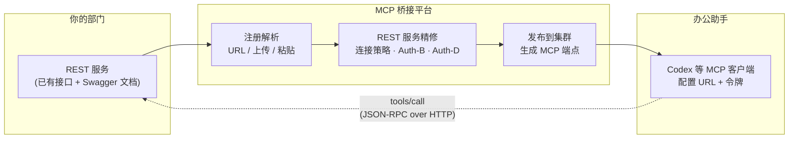
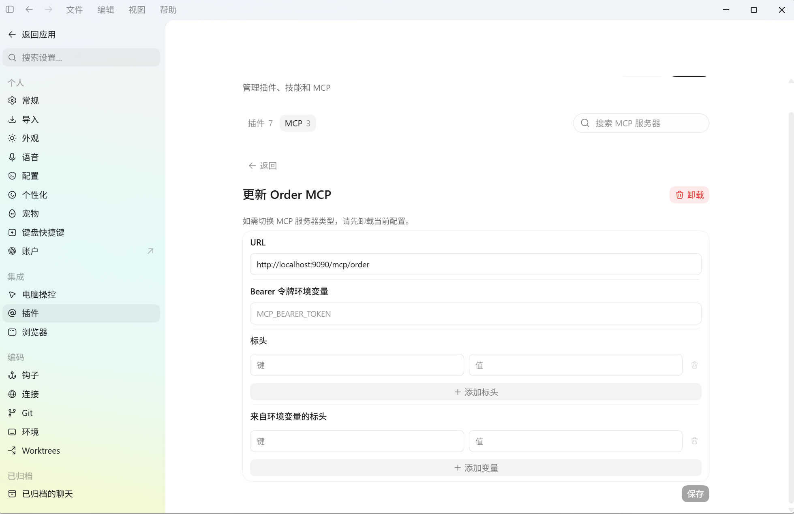

# MCP 桥接平台使用手册

> 主题：如何把 REST API 发布成一个 MCP Server，并在日常办公助手中接入使用（以 Codex 为例）
> 适用范围：平台 v0.2（MCP 2026-07-28 协议）｜整理日期：2026-09-07
> 配套文档：[控制面 API 契约](API.md)｜[架构说明](ARCHITECTURE.md)｜[产品规格 v0.2](PRD/MCP平台_产品规格文档_v0.2.md)

---

## 1. 这份手册解决什么问题

平台把「企业已有的 REST API」桥接成「可以被 AI 办公助手直接调用的 MCP Server」。你只需做一次发布，之后任何支持 MCP 的客户端（Codex、Cursor、Claude Desktop 等）都能通过一个 URL 调用你部门沉淀的接口能力。

本手册覆盖两条主线：

| 主线 | 内容 | 章节 |
| --- | --- | --- |
| 发布 | 把 REST 服务（Swagger 文档）发布成 MCP Server，获得对外 MCP 端点 | §5 |
| 接入 | 在办公助手中配置并调用已发布的 MCP Server（以 Codex 为例） | §7 |

次要场景：跨部门访问申请（§6）、常见问题（§8）、控制面 REST 脚本化发布（§9）。

---

## 2. 概念速览

| 概念 | 一句话说明 |
| --- | --- |
| REST 服务 / Swagger | 你要对外暴露的既有接口，用一份 OpenAPI/Swagger 文档描述 |
| 注册解析 | 把 Swagger 文档收进平台，解析成可治理的结构（支持 URL / 上传文件 / 粘贴内容三种方式） |
| Server | 一个 MCP Server 逻辑单元 = 一个对外 PATH 端点 + 若干 REST 服务 |
| REST 服务 | Server 下挂的每个 REST 服务（一份 Swagger 对应一个，含独立的超时/重试/熔断/鉴权） |
| Tool | 由 Swagger 的每个 operation 自动生成的 MCP 工具（如 `GET /api/orders` → `t_listOrders`） |
| 覆盖（overlay） | 对 Tool 的二次精修：改名、改参数 Schema、启用/停用，不污染原始文档 |
| Auth-B（REST 服务鉴权） | 平台**调用 REST 服务**时携带的鉴权（Bearer、Basic、Client Credentials 等）；每个 REST 服务各配一份 |
| Auth-D（下行授权） | 客户端**调用平台 MCP 端点**时的鉴权（NONE / STATIC_BEARER 两种可用形态） |
| 发布 | 把 Server 的生效快照下发到集群 Executor，对外提供服务；支持下线与回滚 |
| MCP 端点 | 发布后客户端访问的地址，形如 `{集群入口}/{前缀}/{PATH 末段}`，例如 `http://localhost:9090/mcp/order` |
| 访问申请 | 非本部门（但有读权限）的用户，向 Server 所属部门申请访问授权的流程 |

---

## 3. 端到端总览



---

## 4. 发布前准备

1. **能登录控制台**：账号由管理员在「账号」菜单创建；本次操作需要 `server:write`（管理 Server）、`registration:create`（注册文档）、`publish:execute`（发布）权限点。不确定时请平台管理员给你配「平台管理员 / Server 管理」类角色。
2. **准备一份 Swagger 文档**：`OpenAPI 3.x` 或 `Swagger 2.0` 均可。可以是一个文档 URL、一个本地 json/yaml 文件，或一段可直接粘贴的文本。
3. **确认 REST 服务可达**：平台 Executor 需要能访问到你的服务地址（`http://…`）。只做连通性验证时，可先启动仓库自带的最小 REST 测试服务（`mcp-executor` 测试目录的 `TestRestService`，常驻 `http://127.0.0.1:18080`，提供订单/用户两组接口）。
4. **约定 PATH 末段**：它决定客户端访问 URL 的最后一段（示例：`order` → `…/mcp/order`），需全局唯一、符合平台正则。

---

## 5. 把 REST API 发布成 MCP Server（界面操作）

### 5.1 从概览进入

登录后落在「概览」。统计卡展示全局状态（MCP Server 数 / 已发布数 / Tool 数 / 在线节点数），「常用操作」区提供两个入口：**新建 Server**、**注册 REST API**。如果你要发布的 Server 已存在，直接去「MCP Server」列表选择它。


左侧菜单顺序：概览 → MCP Server → 访问申请 → 集群与节点 → 部门 → 角色权限 → 账号 → 审计日志。

### 5.2 新建 / 选择一个 Server

在「MCP Server」列表页点击右上角 **新建 Server**，或点击已有 Server 行的「详情」继续配置。


列表「域名」列展示**发布后**的 MCP 端点（未发布显示「未发布，无端点」）；状态为「已发布」表示当前可被客户端访问。示例环境中的 `order` Server：Tool 5/5、端点 `http://localhost:9090/mcp/order`。

新建对话框会提示：创建后得到的是一个**空 Server（无 tool、无 REST 服务）**，接下来到详情页「REST 服务」注册文档。

### 5.3 基本信息

Server 详情页第一个 Tab「基本信息」：

| 字段 | 说明 | 示例 |
| --- | --- | --- |
| 服务名 | MCP Server 标识字段，全局唯一（PATH 末段据此生成） | `order` |
| 展示名 | 给人看的名称 | `订单服务` |
| 描述 | 用途说明 | 订单域接口 |
| PATH 前缀 | 由系统按集群保留前缀生成，不可随意改 | `mcp` |
| tools/list TTL | 客户端工具清单缓存时长；0 表示禁用缓存 | `30000` ms |

> 此 Tab 每次保存都会提示「已保存，需重新发布后对 MCP Client 生效」——**基本信息的任何修改都要重新发布**（见 §5.7）。


### 5.4 REST 服务：注册 Swagger + 配置连接与鉴权

这是「注册 REST API」动作发生的地方。切到「REST 服务」Tab，点击 **注册文档到本 Server**，弹窗提供三种收文档方式：

| Tab | 用法 | 适用 |
| --- | --- | --- |
| 从 URL 抓取 | 填文档 URL，平台抓取解析 | 文档已有公网/内网地址 |
| 上传文件 | 选择本地 json/yaml 文件 | 本地文档 |
| 粘贴内容 | 把文档全文粘进文本框 | 一次性/临时文档 |

> 注意：从 URL 抓取受平台 SSRF 防护限制——抓取 `127.0.0.1` / `localhost` 等回环地址默认会被拒绝。本地调试要么选「粘贴内容」，要么由部署方设置 `MCP_MANAGER_PARSE_ALLOW_PRIVATE_NETWORKS=true`。

注册成功后会提示生成了几个接口，并自动在「订阅服务」区创建一条上游条目（服务标识 = 注册记录 ID）。解析**失败**（FAILED）时会当场弹出诊断详情（语法错误行等），修正文档后重新注册即可。


点上游条目可展开编辑，字段含义：

| 字段 | 说明 | 默认 |
| --- | --- | --- |
| 服务标识 / 展示名 | 上游的唯一标识与别名 | 注册时自动绑定 |
| 上游地址 | **一行一个**；多个地址走负载均衡（轮询或加权） | — |
| 负载策略 | 轮询 ROUND_ROBIN / 加权 WEIGHTED（权重数量与地址不匹配时退回轮询并告警） | 轮询 |
| 连接超时 / 读取超时 | 毫秒 | 3000 / 30000 |
| 重试次数 | 失败重试；非幂等（POST）自动不重试 | 1 |
| 重试状态码 | 命中即重试 | 502, 500, 504 |
| 熔断（失败阈值 / 半开 / 并发） | 连续失败阈值（如 5 次）开闸，半开窗口期探测，并发上限 | 5 / 30000ms / 2 |

**一份 Swagger = 一个 REST 服务**；同一个 Server 可以聚合多份 Swagger（多服务），tool 注册时自动绑定到所属服务，调用时按归属路由（对应不同 baseUrls / 熔断 / Auth-B，互不影响）。

### 5.5 Tool 与覆盖

切到「Tool 与覆盖」Tab，可看到每个 operation 被自动翻译成的 Tool（示例 `order` Server 的 5 个 Tool）：

| Tool 名 | 方法 + PATH | 说明 |
| --- | --- | --- |
| `t_listOrders` | `GET /api/orders` | 订单列表 |
| `t_createOrder` | `POST /api/orders` | 创建订单 |
| `t_getOrder` | `GET /api/orders/{orderId}` | 订单详情 |
| `t_updateOrder` | `PUT /api/orders/{orderId}` | 更新订单 |
| `t_deleteOrder` | `DELETE /api/orders/{orderId}` | 删除订单 |

支持**批量启用 / 批量禁用**、单 Tool 改名、改参数 Schema、停用。这些都属于「覆盖」，不影响原始 Swagger；想回到原始值直接撤销覆盖即可。


> 被停用或被标记为流式的 Tool，客户端调用会收到 `-32002 TOOL_NOT_FOUND`（流式能力属 P1，见 §8 F3）。

### 5.6 授权配置（按需）

- **Auth-B（REST 服务鉴权，平台 → REST 服务）**：**在「REST 服务」Tab 内配置，每个 REST 服务各持一份**——选中某个服务后，表单下半部分即是它的鉴权配置。支持 NONE / Bearer / Basic / API Key / OAuth2 Client Credentials / 自定义 Header 模板。凭据经 AES-256-GCM 加密后入库，界面只显示掩码，留空=不修改；改动随「保存服务配置」一起提交。
- **Auth-D（MCP 客户端授权，客户端 → 平台 MCP 端点）**：在「MCP 客户端授权 Auth-D」Tab 配置，作用于整个 Server。
  - `NONE`：端点公开，无需令牌；
  - `STATIC_BEARER`：客户端请求需带 `Authorization: Bearer <令牌>`。令牌在「静态令牌」框**一行一个**粘贴（不含 `Bearer ` 前缀）。⚠️ 平台只存 sha256、**明文无法回显**，每次保存是整体替换——漏填等于吊销其余全部，请妥善保管自己生成的令牌；
  - `OAUTH2`：当前版本仅保存元数据，运行时**显式拒绝（501 / `-32004`）**，请勿在生产选用。

  两种授权都在保存后提示「重新发布后生效」。

### 5.7 差异与发布（核心动作）

切到「差异与发布」Tab：上方会列出将下发到 Executor 的**生效模型**（Server 元数据 + Tool 清单）与基线版本的差异对比。确认无误后点击 **发布到集群**，选择目标集群并填写备注。


发布成功 → Server 状态变「已发布」，「MCP Server」列表「域名」列出现可访问端点。此后：

- 修改过任何配置，都要回到这里**重新发布**才对外生效；
- 需要下线：在发布记录里执行下线；需要回退：选择历史版本执行回滚（历史版本永不删除）。

### 5.8 验收：复制 MCP 配置 + curl 冒烟

在「差异与发布」Tab 的发布绑定表里，找到当前生效的发布行，点 **MCP 配置**，会给出可直接使用的两样东西：

1. **mcpServers JSON**——粘给任意支持 MCP 的客户端；
2. **curl 冒烟命令**——不依赖客户端，命令行即可验证端点活着：

```bash
# 能力发现
curl -X POST http://localhost:9090/mcp/order \
     -H 'Content-Type: application/json' \
     -H 'Mcp-Protocol-Version: 2026-07-28' \
     -H 'Mcp-Method: server/discover' \
     -d '{"jsonrpc":"2.0","id":1,"method":"server/discover","params":{}}'

# 调一个 tool
curl -X POST http://localhost:9090/mcp/order \
     -H 'Content-Type: application/json' \
     -H 'Mcp-Protocol-Version: 2026-07-28' \
     -H 'Mcp-Method: tools/call' \
     -H 'Mcp-Name: get_orders_id' \
     -d '{"jsonrpc":"2.0","id":1,"method":"tools/call",
          "params":{"name":"get_orders_id","arguments":{"id":"A-1"}}}'
```

端点若配置了 STATIC_BEARER，两段命令都要补 `-H 'Authorization: Bearer <令牌>'`。

---

## 6. 跨部门访问申请（可选）

平台按部门隔离管理：**本部门管理本部门的 Server**；其他部门的人即使有读权限，也不能直接调用，需要走「访问申请」。

在「访问申请」菜单（Tab：申请目录 / 我发起的 / 申请处理）：

1. 「申请目录」找到目标 Server，点 **申请访问**；
2. 填写**申请理由**（说明用途，审批人据此判断），提交；
3. Server 所属部门的审批人进入「申请处理」审批（同意/驳回；同意后也可随时回收授权）；
4. 申请通过后，你才能拿到/使用该 Server 的令牌与端点。


> 若 Server 的 Auth-D 是 `NONE`（公开），理论上无需申请即可调用；平台仍建议保留 Auth-D 校验以追踪调用方。

---

## 7. 在办公助手中接入 MCP Server——以 Codex 为例

发布完成后，任何支持 MCP Streamable HTTP 的客户端都能接入；原理只有一个：**给客户端一个 URL，再告诉它怎么带令牌**。以下以 Codex 为例（CLI 与桌面端共用同一份 `config.toml` 配置）。

### 7.1 你需要两样东西

| 需要 | 去哪拿 |
| --- | --- |
| MCP 端点 URL | 「MCP Server」列表「域名」列，或发布详情「MCP 配置」弹窗，形如 `http://localhost:9090/mcp/order` |
| 令牌（Auth-D = STATIC_BEARER 时） | 联系该 Server 所属部门的授权人 / 走 §6 申请；令牌由你自行保管在环境变量里 |

### 7.2 方式一：Codex 桌面端（图形界面）

Codex App / IDE 扩展的 **设置 → 集成 → MCP**（搜索「MCP」进入「管理插件、技能和 MCP」）。已接入的 Server 会列在 MCP Tab 下（可看到现有 3 个 MCP 服务器）。点已有条目可「更新」配置：



| 字段 | 对应 config.toml 项 | 填写示例 |
| --- | --- | --- |
| URL | `url` | `http://localhost:9090/mcp/order` |
| Bearer 令牌环境变量 | `bearer_token_env_var` | `MCP_BEARER_TOKEN`（Codex 会读该环境变量并自动带 `Authorization: Bearer`） |
| 标头（静态值） | `http_headers` | 一般不用填 |
| 来自环境变量的标头 | `env_http_headers` | 需要非 Bearer 风格头时用（如 `X-Api-Key`） |

> 切换 MCP 服务器类型（STDIO ↔ HTTP）需先卸载当前条目再重新添加——界面右上角「卸载」即为此用。保存前先确认环境变量已存在，否则保存按钮不可用。

### 7.3 方式二：CLI / 直接改 `config.toml`（推荐）

Codex 的 MCP 配置在 `~/.codex/config.toml`（用户级）或项目级 `.codex/config.toml`（仅受信任项目）。CLI 与桌面端共享同一份配置。

**用命令添加**（简单场景）：

```bash
codex mcp add order --url http://localhost:9090/mcp/order
codex mcp list          # 查看已接入
codex mcp remove order  # 移除
```

**手写配置**（精细控制，推荐）：

```toml
[mcp_servers.order]
url = "http://localhost:9090/mcp/order"
bearer_token_env_var = "MCP_BEARER_TOKEN"      # 令牌走环境变量，绝不明文写进文件
# 可选：需要额外请求头时
# env_http_headers = { "X-Tenant-Id" = "MCP_TENANT_ID" }
# tool_timeout_sec = 60
# enabled_tools = ["t_listOrders", "t_getOrder"]   # 白名单
```

先设置环境变量（Windows PowerShell）：

```powershell
$env:MCP_BEARER_TOKEN = "粘贴你在平台配置的静态令牌"
# 若希望跨会话持久：setx MCP_BEARER_TOKEN "粘贴令牌" （仅 Windows）
```

macOS / Linux：

```bash
export MCP_BEARER_TOKEN="粘贴你在平台配置的静态令牌"   # 建议写进 ~/.zshrc 或 ~/.bashrc
```

改完配置**重启 Codex** 使其加载。

### 7.4 验证已生效

1. Codex 会话里输入 `/mcp`，能看到 `order` 服务器处于 connected 状态；
2. 直接提问让它用平台暴露的能力，例如：

   > 「帮我查一下订单列表，并告诉我最近一个订单的状态」

3. 平台侧可在「审计日志」里看到来自 Codex 的 `tools/call` 记录（Server 调用的可观测入口）。

> 同样的配置思路适用于其他 MCP 客户端：本质都是 `url + Authorization`。Auth-D 为 NONE 时不需要令牌，配置里删掉令牌相关项即可。

---

## 8. 常见问题

| # | 现象 / 报错 | 原因与处理 |
| --- | --- | --- |
| F1 | 客户端报 `-32022 UNSUPPORTED_PROTOCOL_VERSION` | 客户端用的还是 legacy 协议形态（如带 `Mcp-Session-Id` / 老版本号）。平台 Modern-only、**不做版本协商**：升级客户端到支持 MCP 2026-07-28 的版本，或按错误 `data.upgradeUrl` 处理 |
| F2 | 调用返回 `401` / `-32004 UNAUTHORIZED` | Auth-D = STATIC_BEARER 时令牌缺失、写错或已被吊销。核对令牌与 `Bearer ` 前缀；令牌管理是整体替换，改过一次后旧令牌即失效 |
| F3 | `-32002 TOOL_NOT_FOUND` | Tool 不存在 / 已被停用 / 被标记为流式（流式属 P1，未实现前会从 `tools/list` 剔除并拒绝调用） |
| F4 | `-32003 UPSTREAM_ERROR`（或上游 502） | 上游 REST 超时 / 5xx / 熔断打开。先确认 REST 服务本身健康；熔断触发后等半开窗口自动探测恢复 |
| F5 | 改了配置但客户端行为没变 | 所有修改都要到「差异与发布」**重新发布**才生效；同时注意客户端侧的 tools/list 缓存（TTL 30000ms） |
| F6 | 忘记 Auth-D 静态令牌 | 平台只存 sha256，**无法找回明文**；在「下行授权 Auth-D」整体替换为新令牌并重新发布，然后更新客户端环境变量 |
| F7 | 想删除 Server 但被拒（409） | 该 Server 仍发布在集群上（current && PUBLISHED）。先在发布记录里下线，再删除；删除会连带清理文档记录与授权，不可恢复 |
| F8 | 想用 OAUTH2 模式 | 当前版本仅存元数据、运行时显式拒绝（501 / `-32004`）。生产请用 NONE（内网）或 STATIC_BEARER（外网），OAUTH2 属 P1 规划 |
| F9 | 访问 `…/mcp/xxx` 返回 `-32001 SERVER_NOT_FOUND` | PATH 末段未发布或已下线：核对列表「域名」列的准确末段 |
| F10 | 上游有多个实例怎么配 | 「上游地址」框一行一个地址，选轮询或加权即可；权重数量与地址数量不一致时自动退回轮询并告警 |

---

## 9. 附：控制面 REST API 脚本化速查

不想点界面时，控制面 REST 可以完成整条发布链路。约定：**控制面** `http://localhost:8080/api/v1`（manager），**MCP 数据面** `http://localhost:9090/mcp/{PATH 末段}`（executor / 集群入口）。以下命令需 `curl` 与 `jq`（Windows 可用 Git Bash + jq，或把 `| jq -r ...` 换成 `python -c "import sys,json;print(json.load(sys.stdin)['data']['xxx'])"`）。

**注册接口两种语义**（重要）：

| 语义 | 用法 | 适用 |
| --- | --- | --- |
| 自动建 Server | 注册文档时**不带** `targetServerId` | 快速发布单一 REST 服务（下图主流程） |
| 挂到已有 Server | 注册文档时带 `targetServerId=<serverId>` | 多上游聚合：一个 Server 挂多份 Swagger（§5.4） |

```bash
BASE=http://localhost:8080/api/v1

# 1) 登录拿令牌（公开接口；密码为部署时设置的管理员密码）
TOKEN=$(curl -s -X POST $BASE/auth/login \
  -H 'Content-Type: application/json' \
  -d "{\"username\":\"admin\",\"password\":\"$MANAGER_ADMIN_PASSWORD\"}" | jq -r .data.token)

AUTH="Authorization: Bearer $TOKEN"

# 2) 注册一份 Swagger（不传 targetServerId → 自动创建 Server）
#    三选一：上传文件 / URL / 粘贴原文
curl -s -X POST $BASE/registrations/upload \
  -H "$AUTH" -F "name=order-service" -F "file=@openapi.json" | jq .
# curl -s -X POST $BASE/registrations/by-url \
#   -H "$AUTH" -H 'Content-Type: application/json' \
#   -d '{"name":"order-service","url":"https://example.com/openapi.json"}' | jq .
# curl -s -X POST "$BASE/registrations/by-text?name=order-service" \
#   -H "$AUTH" -H 'Content-Type: application/json' --data-binary @openapi.json | jq .

#    响应含 serverId；想挂到已有 Server（多上游）时追加表单参数 targetServerId：
#    -F "targetServerId=12"   /   &targetServerId=12   /  body 加 targetServerId

# 3) 用响应里的 serverId 继续（SERVER_ID 替换为第 2 步返回的 data.serverId）
SERVER_ID=<上一步返回的 serverId>
SEGMENT=$(curl -s $BASE/servers/$SERVER_ID -H "$AUTH" | jq -r .data.pathSegment)
echo "PATH 末段: $SEGMENT   （不要凭直觉拼，读回来最稳）"

# 4) 查看自动解析出的 Tool
curl -s $BASE/servers/$SERVER_ID/tools -H "$AUTH" | jq -r '.data[].name'

# 5) 发布到集群（传播上界约 30s = Executor 快照轮询间隔）
CLUSTER_ID=$(curl -s $BASE/clusters -H "$AUTH" | jq -r '.data[0].id')
curl -s -X POST $BASE/servers/$SERVER_ID/publish \
  -H "$AUTH" -H 'Content-Type: application/json' \
  -d "{\"clusterId\":$CLUSTER_ID,\"note\":\"首次发布\"}" | jq .

# 6) 冒烟：server/discover / tools/list
curl -s -X POST http://localhost:9090/mcp/$SEGMENT \
  -H 'Content-Type: application/json' \
  -H 'Mcp-Protocol-Version: 2026-07-28' \
  -H 'Mcp-Method: server/discover' \
  -d '{"jsonrpc":"2.0","id":1,"method":"server/discover","params":{}}' | jq .
```

> 本地 URL 抓取受 SSRF 防护限制（回环地址默认拒绝），本地调试建议用上传/粘贴方式，或由部署方开启 `MCP_MANAGER_PARSE_ALLOW_PRIVATE_NETWORKS=true`。

完整端点与错误码见 [API.md](API.md)（§2 控制面、§4 数据面 MCP 端点与 JSON-RPC 错误码表）。

---

## 10. 延伸阅读

- [API.md](API.md)——控制面 REST 契约、MCP 端点契约、权限点与错误码
- [ARCHITECTURE.md](ARCHITECTURE.md)——分层架构、双跳鉴权、失败语义（含已知缺口 §10）
- [PRD v0.2](PRD/MCP平台_产品规格文档_v0.2.md)——需求来源与编号（本文的 SVR/PUB/EXE/BR 编号均可回溯）
- [ADR-0003](adr/ADR-0003-streaming-bridge.md)——流式 tool（P1）的既定方案：Streamable HTTP SSE + 缓冲兜底
- [README 待办清单](../README.md)——当前未完成项与排期状态
